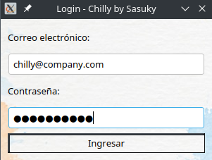

# Chilly


 - [Instalación y uso](#instalación-y-uso)
 - [Documentación APP](./app/README.md)
 - [Documentación Back-End](./Back-End/README.md)

Aplicación de Gestión de Producto para el negocio. Para poder facilitar el manejo de los productos con la finalidad de tener todo organizado y registrado en un sistema digital.

Esto se pospone hasta terminar el proyecto, la demas documentación se encuentra dentro de cada zona: Back-End y App 

## Instalación y uso:
Para utilizar el programa debemos descargar la aplicación:
```bash
git clone https://github.com/Susaky-Technology/Chilly.git
```
> También puedes descargar el código comprimido [Archivo comprimido en formato .zip](https://github.com/Susaky-Technology/Chilly/archive/refs/heads/version.2.2.zip) 

# [Documentación del Back-End](./Back-End/README.md)
Para terminar la instalación te recomendamos visitar la sección de BackEnd

## Login/Splash
Esta es la pantalla de bienvenida, esta realizada en Tkinter.
1. Ingresas tu correo
2. Ingresas tu cédula -> Esto es solo temporal



## Pantalla de Trabajador (Cajero && Bodega)
Obtenemos la pantalla para manejar los productos, en futuras versiones existira mayor funcionalidad.
